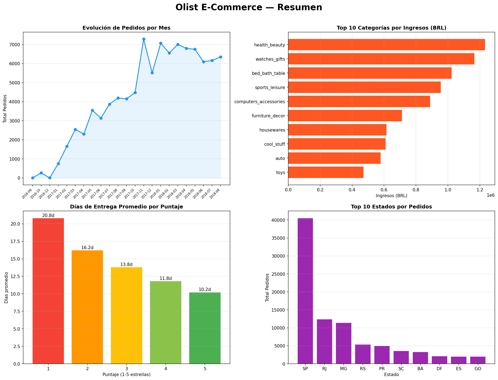
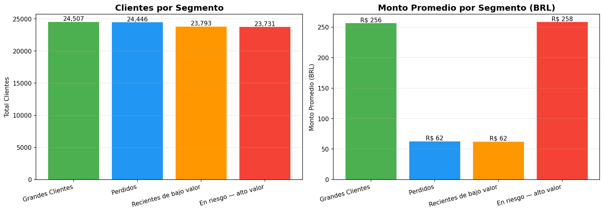
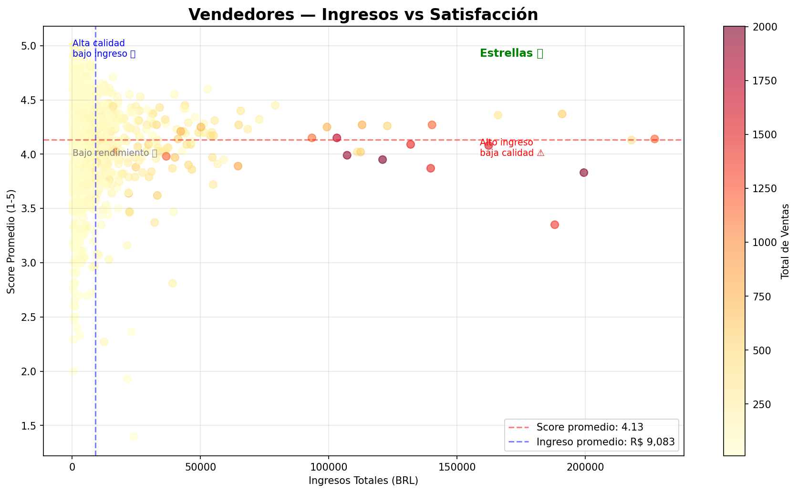

#  Olist E-Commerce — Análisis Exploratorio

Dashboard interactivo con análisis completo del marketplace brasileño Olist.

[](https://olist-ecommerce-analysis-4twcutxpzkujopvnuqlvxz.streamlit.app/)





## ¿Qué incluye este proyecto?

- Evolución de ventas 2016-2018 con comparación YoY
- Top categorías por volumen e ingresos
- Correlación entre tiempo de entrega y satisfacción del cliente
- Análisis geográfico por estados de Brasil
- Segmentación de clientes con modelo RFM
- Performance de vendedores por cuadrantes

## Insights 

- Los pedidos casi se duplicaron de 2017 a 2018
- Los clientes con 1 estrella esperan el doble que los de 5 estrellas
- Solo el 22.5% de los vendedores son "estrellas" (ingresos y satisfacción por encima de la mediana)
- El 100% de los clientes compró una sola vez — oportunidad de fidelización. Por eso la segmentación RFM usa solo Recencia y Monto: la Frecuencia es constante (siempre 1) y no aporta al modelo
- SP, RJ y MG concentran el 67% de todos los pedidos

## Tecnologías utilizadas

- Python 3.12
- Pandas — manipulación de datos
- Plotly — visualizaciones interactivas
- Streamlit — dashboard web

## Estructura del proyecto
Olist/
├── data/ # Dataset de Olist
├── olist_analisis.ipynb # Análisis exploratorio completo
├── olist_app.py # Dashboard Streamlit
├── requirements.txt # Dependencias del proyecto
└── README.md # Este archivo
## ¿Cómo correr el proyecto?

1. Cloná el repositorio
2. Instalá las dependencias
```bash
pip install -r requirements.txt
```
3. Corré el dashboard
```bash
streamlit run olist_app.py
```

## Dataset

[Brazilian E-Commerce Public Dataset by Olist](https://www.kaggle.com/datasets/olistbr/brazilian-ecommerce)

> El repo incluye los CSV que usa el dashboard, excepto `olist_geolocation_dataset.csv` (~59 MB, no se usa en ningún análisis). Si querés explorarlo vos, descargalo del link de Kaggle y colocalo en `data/`.